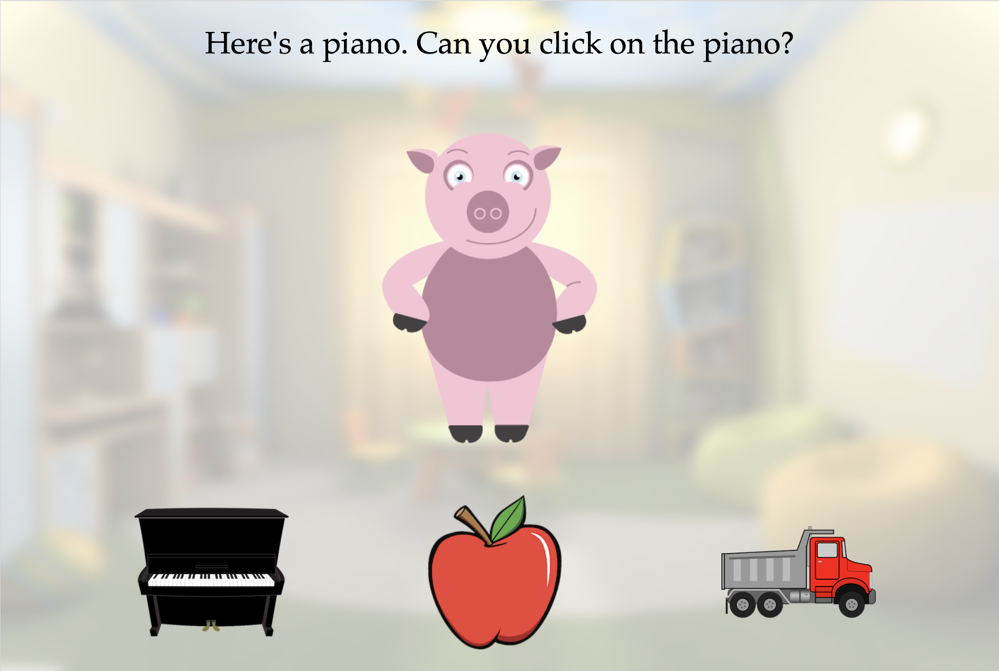
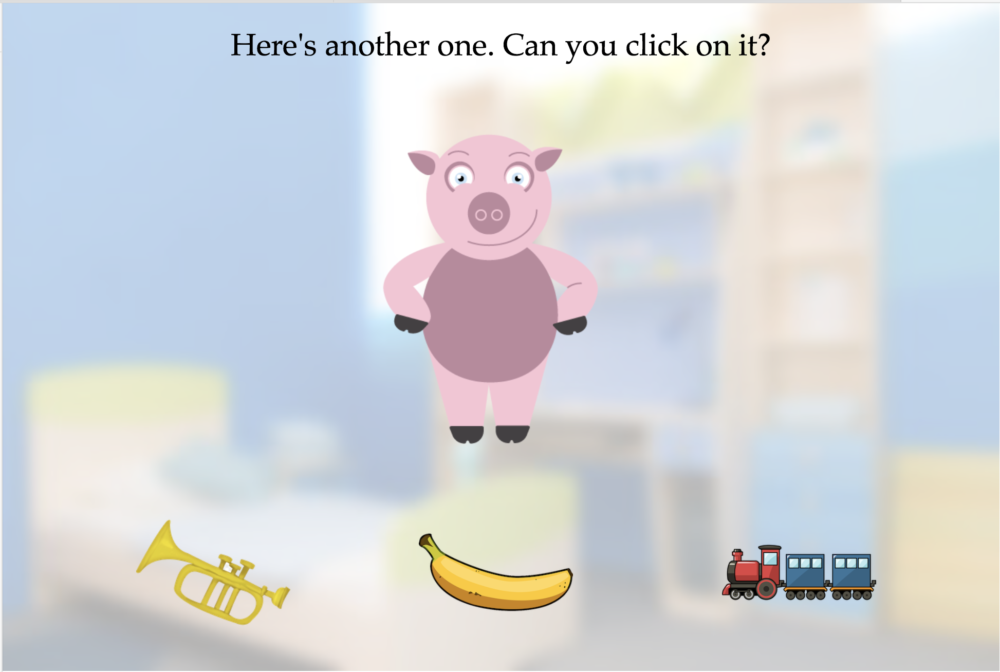
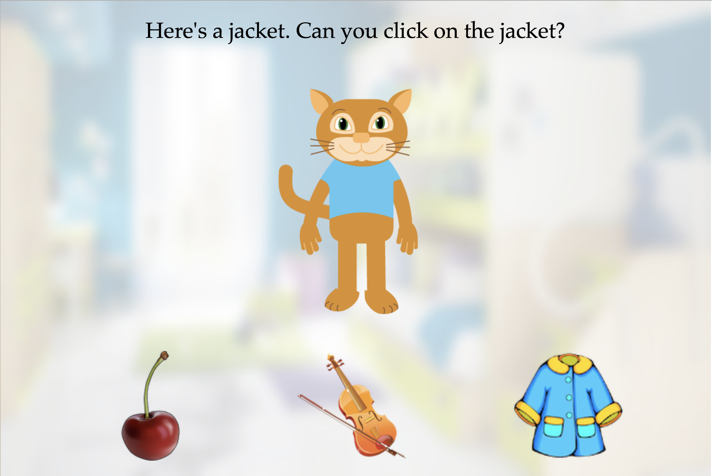
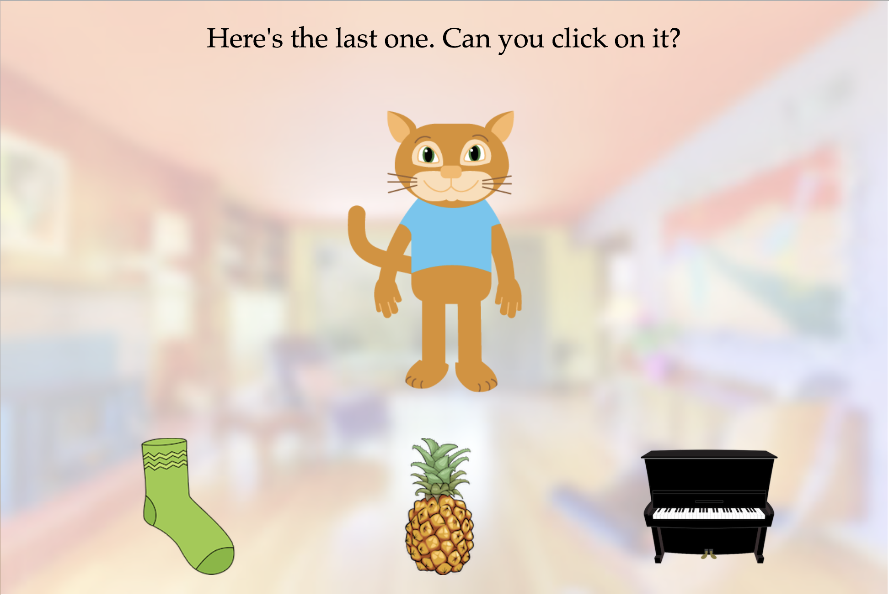
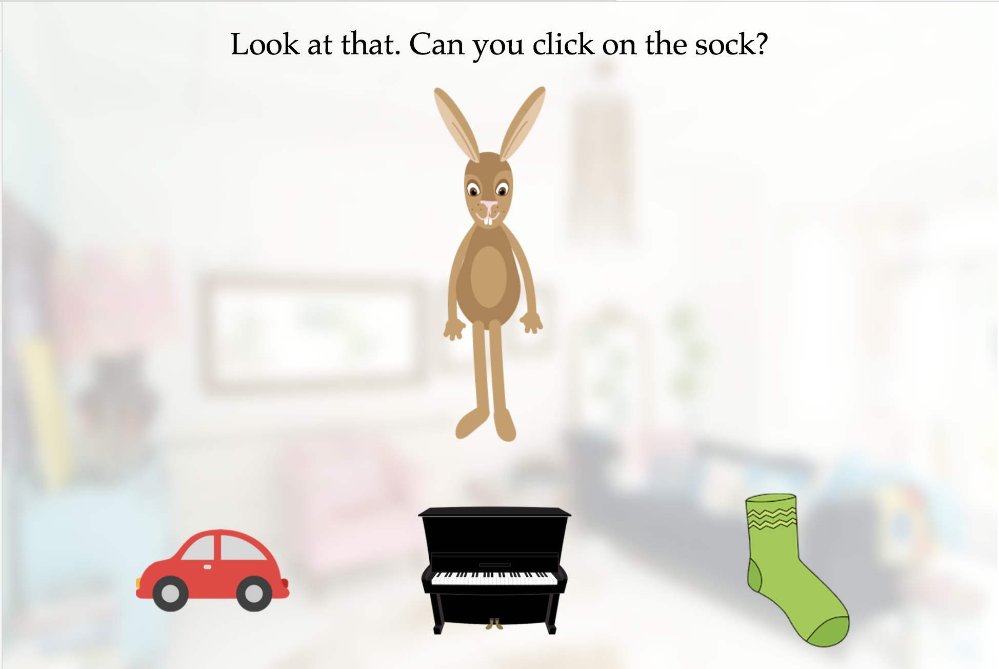
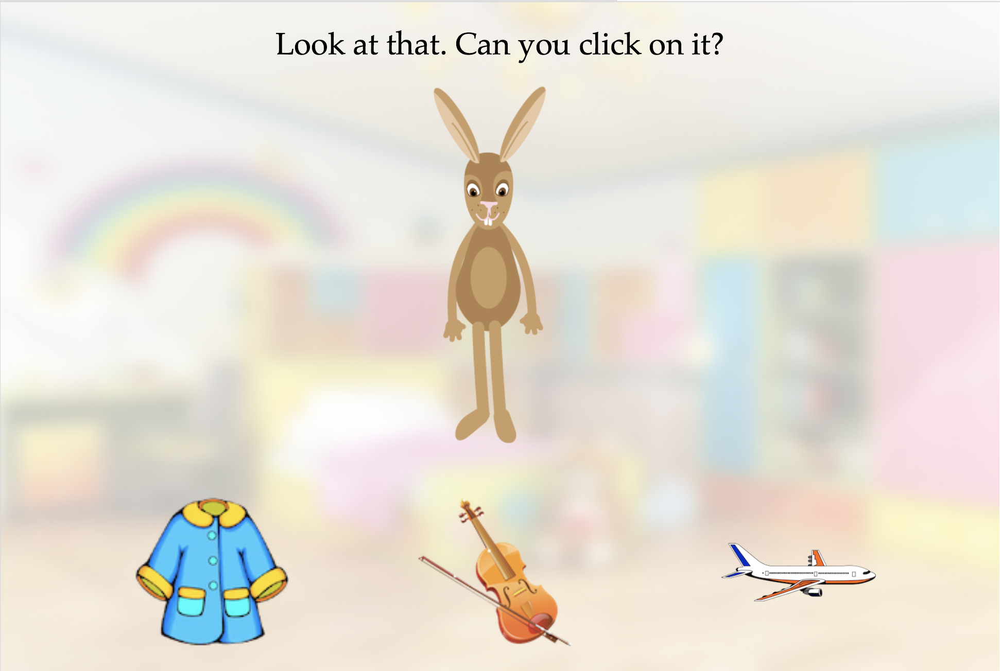

Successful communication requires coordination between speakers and listeners in a variety of ways. The accrual of shared knowledge between interlocutors (e.g. "common ground") during discourse is of particular interest. To date, most theories characterize common ground in a categorical fashion - either you have it or you don't. We explore the degree to which interlocutors display graded sensitivity to common ground, maintaining uncertainty over shared knowledge during a conversation.

```{r setup, include=FALSE}
#Libraries
knitr::opts_chunk$set(echo = FALSE, warning = FALSE) #no code, no warning printed
library(knitr)
library(tidyverse)
library(ggplot2)
library(jsonlite)
library(tidyr)
library(stringr)
library(dplyr)
library(ggthemes)
library(langcog)
```

```{r data loading, include=FALSE}
knitr::opts_chunk$set(echo = FALSE, warning = FALSE) 

#Pilot data preprocessing
files <- dir("../../pilot_1_raw_data/production-results")

raw_data <- data_frame()
for (f in files) {
  jf <- paste("../../pilot_1_raw_data/production-results/",f,sep="")
  jd <- fromJSON(paste(readLines(jf), collapse=""))
  id <- as_data_frame(jd$answers$data$data) %>%
    mutate(workerid = jd$WorkerId)
  raw_data <- bind_rows(raw_data, id)
}

data_pilot_another <- raw_data %>%
  mutate(distribution = as.character(distribution),
         distribution = factor(distribution, levels = c("c(6, 0, 0)", "c(4, 2, 0)", "c(2, 2, 2)")))

#Recency "Here's another one" data preprocessing
files <- dir("../../recency_raw_data/production-results")

raw_data <- data_frame()
for (f in files) {
  jf <- paste("../../recency_raw_data/production-results/",f,sep="")
  jd <- fromJSON(paste(readLines(jf), collapse=""))
  id <- as_data_frame(jd$answers$data$data) %>%
    mutate(workerid = jd$WorkerId)
  raw_data <- bind_rows(raw_data, id)
}

data_recency_another <- raw_data %>%
  mutate(distribution = as.character(distribution),
         distribution = factor(distribution, levels = c("c(5, 1, 0)", "c(2, 2, 2)")))

data_ip <- data_recency_another %>%
  filter(phase == 'training') %>%
  group_by(workerIp) %>%
  summarise(correct = mean(correct_item))

data_recency_another <- data_recency_another %>% 
  distinct(workerIp, trial, slide, .keep_all = TRUE)

#Recency "Here's the last one." data preprocessing
files <- dir("../../recency_last_raw_data/production-results")

raw_data <- data_frame()
for (f in files) {
  jf <- paste("../../recency_last_raw_data/production-results/",f,sep="")
  jd <- fromJSON(paste(readLines(jf), collapse=""))
  id <- as_data_frame(jd$answers$data$data) %>%
    mutate(workerid = jd$WorkerId)
  raw_data <- bind_rows(raw_data, id)
}

data_recency_last <- raw_data %>%
  mutate(distribution = as.character(distribution),
         distribution = factor(distribution, levels = c("c(5, 1, 0)", "c(2, 2, 2)")))

data_ip <- data_recency_last %>%
  filter(phase == 'training') %>%
  group_by(workerIp) %>%
  summarise(correct = mean(correct_item))

data_recency_last <- data_recency_last %>% 
  distinct(workerIp, trial, slide, .keep_all = TRUE)

#Recency look data preprocessing
files <- dir("../../recency_look_raw_data/production-results")

raw_data <- data_frame()
for (f in files) {
  jf <- paste("../../recency_look_raw_data/production-results/",f,sep="")
  jd <- fromJSON(paste(readLines(jf), collapse=""))
  id <- as_data_frame(jd$answers$data$data) %>%
    mutate(workerid = jd$WorkerId)
  raw_data <- bind_rows(raw_data, id)
}

data_recency_look <- raw_data %>%
  mutate(distribution = as.character(distribution),
         distribution = factor(distribution, levels = c("c(5, 1, 0)", "c(2, 2, 2)")))

data_ip <- data_recency_look %>%
  filter(phase == 'training') %>%
  group_by(workerIp) %>%
  summarise(correct = mean(correct_item))

data_recency_look <- data_recency_look %>% 
  distinct(workerIp, trial, slide, .keep_all = TRUE)

#Combine recency data
data_recency <- bind_rows(data_recency_another, data_recency_last, data_recency_look)
```

```{r sanity checks, include=FALSE} 
#remove duplicated ips and workers who do not pass the training threshold
knitr::opts_chunk$set(echo = FALSE, warning = FALSE)

# Training threshold check for data_pilot_another
data_pilot_another %>%
  filter(phase == 'training') %>%
  group_by(workerid) %>%
  summarise(correct = mean(correct_item))

drop <- data_pilot_another %>%
  filter(phase == 'training') %>%
  group_by(workerid) %>%
  summarise(correct = mean(correct_item)) %>%
  filter(correct < 0.83) %>%
  pull(workerid)

data_pilot_another <- data_pilot_another %>%
  filter(!workerid %in% drop)

# IP check for data_recency
data_recency <- data_recency %>% 
  distinct(workerIp, trial, slide, .keep_all = TRUE)

# Training threshold check for data_recency
data_recency %>%
  filter(phase == 'training') %>%
  group_by(workerid) %>%
  summarise(correct = mean(correct_item))

drop <- data_recency %>%
  filter(phase == 'training') %>%
  group_by(workerid) %>%
  summarise(correct = mean(correct_item)) %>%
  filter(correct < 0.83) %>%
  pull(workerid)

data_recency <- data_recency %>%
  filter(!workerid %in% drop)
```

# Pilot Experiment

## Task description

Each experiment contains 6 trials. Each trial contains 6 training slides (non-ambiguous utterance) and 1 test slide (ambiguous utterance), as shown below. For the first experiment, the ambiguous utterance consists of saying "Here's another one."


{width=350px} {width=350px}

Left: training slide, Right: test slide


The items appearing in a trial belong to a set of 3 categories of items (for e.g. musical instruments, fruits, vehicles) that is unique across 6 trials. We run the experiment with distributions (6-0-0), (4-2-0), and (2-2-2), with each number corresponding to how many times a category has items appear in the trial. 

## Sample size
We remove responses that get less than 5/6 correct in training slides. If there are duplicated IPs, we only take the first response.
```{r sample size data_pilot_another, echo=FALSE}
# summarise all unique ips across 3 experiments (do this after general description of task)

sample_size <- data_pilot_another %>%
  distinct(workerid, .keep_all = TRUE)

sample_size %>%
 summarise(n = n()) %>%
 kable()
```

## Finding
```{r pilot_plot1, fig.width = 8, echo=FALSE}
pilot_plot1 <- data_pilot_another %>%
  filter(phase == 'test') %>%
  group_by(distribution, workerid) %>%
  summarise(correct = mean(correct_target1),
            correct2 = mean(correct_target2),
            correct3 = mean(correct_target3)) %>%
  gather(item, prop_correct, -distribution, -workerid) %>%
  group_by(distribution, item) %>%
  multi_boot_standard(col = "prop_correct")


ggplot(pilot_plot1,
       aes(x = item, y=mean, fill=item)) +
  geom_bar(stat='identity') +
  geom_linerange(aes(ymin = ci_lower, ymax = ci_upper)) +
  scale_fill_solarized(name = "Chosen item",
                       breaks = c("correct", "correct2", "correct3"),
                       labels = c("most frequent", "second most frequent", "least frequent"))+
  facet_grid(~distribution, 
             labeller = as_labeller(c(`c(6, 0, 0)` = "Distribution\n(6-0-0)", `c(4, 2, 0)` = "Distribution\n(4-2-0)", `c(2, 2, 2)` = "Distribution\n(2-2-2)"))) +
  geom_hline(yintercept = 1/3, lty=2) +
  ylim(0, 1) +
  theme_few() +
  theme(axis.text.x = element_blank(), axis.ticks.x = element_blank()) +
  labs(x="", y= "proportion chosen")
```

The dotted line represents performance expected by chance (1/3), and the error bar are 95% CIs.

In distribution (6-0-0), most participants choose the most frequent category. 

There is a graded response in distribution (4-2-0) corresponding to the frequency of appearance of each category. This fits with our hypothesis that people use common ground to identify the reference of an ambiguous utterance. 

However, this result could also be driven by a recency effect where participants simply choose according to the category of the last seen item.

```{r pilot_plot2, fig.width = 8, echo=FALSE}
pilot_plot2 <- data_pilot_another %>%
  filter(phase == "test", distribution != "c(6, 0, 0)") %>%
  group_by (distribution, workerid) %>%
  summarise (lastInput = mean(same_lastInput),
             n = n()) %>% 
  multi_boot_standard(col = "lastInput")

ggplot(pilot_plot2,
       aes(x = distribution, y = mean, fill = distribution)) +
  geom_bar(stat='identity', width = 0.3) +
  geom_linerange(aes(ymin = ci_lower, ymax = ci_upper)) +
  scale_fill_solarized(name = "Distribution",
                       breaks = c("c(6, 0, 0)", "c(4, 2, 0)", "c(2, 2, 2)"),
                       labels = c("(6-0-0)", "(4-2-0)", "(2-2-2)"))+
  geom_hline(yintercept = 1/3, lty=2) +
  ylim(0, 1) +
  theme_few() +
  theme(axis.text.x = element_blank(), axis.ticks.x = element_blank()) +
  labs(x="", y= "proportion chosen same as last item")
```

We see that participants are choosing the item in the test slide in the same category as the last training item above chance, suggesting a possibly strong recency effect.

The reason we're seeing this recency effect may be the semantics of "another" as it makes strong reference to the last category seen.

# Recency Effect Experiment

In order to look at the recency effect more closely, we manipulate the experiment to look at distribution (5-1-0) where the last item preceding the test slide is never in the most frequent category. We vary the wording in the ambiguous utterance. 

## Task description

We use 2 new phrasings for the test slide, "Here's the last one" and "Look at that." Distribution (2-2-2), with all category appearances randomized, is used as the control.

{width=350px} {width=350px}

{width=350px} {width=350px}

Left: training slide, Right: test slide

## Sample size
We remove responses that get less than 5/6 correct in training slides. If there are duplicated IPs, we only take the first response.
```{r sample size data_recency, echo=FALSE}
# summarise all unique ips across 3 experiments (do this after general description of task)

sample_size <- data_recency %>%
  distinct(workerid, .keep_all = TRUE)

sample_size %>%
 mutate(wording = ifelse(experiment == "recency", "another one", ifelse(experiment == "recency_last ", "last one", "look at that"))) %>%
 group_by(wording) %>%
 summarise(n = n()) %>%
 kable()
```

## Finding
```{r recency_plot1, fig.width = 8, echo = FALSE}
recency_plot1 <- data_recency %>%
  filter(phase == 'test', distribution == "c(5, 1, 0)") %>%
  group_by(distribution, workerid, experiment) %>%
  summarise(correct = mean(correct_target1),
            correct2 = mean(correct_target2),
            correct3 = mean(correct_target3)) %>%
  gather(item, prop_correct, -distribution, -workerid, -experiment) %>%
  group_by(distribution, item, experiment) %>%
  multi_boot_standard(col = "prop_correct")


ggplot(recency_plot1,
       aes(x = item, y=mean, fill=item)) +
  geom_bar(stat='identity') +
  geom_linerange(aes(ymin = ci_lower, ymax = ci_upper)) +
  scale_fill_solarized(name = "Chosen item",
                       breaks = c("correct", "correct2", "correct3"),
                       labels = c("most frequent", "second most frequent", "least frequent"))+
  facet_grid(~experiment, 
             labeller = as_labeller(c(`c(5, 1, 0)` = "Distribution\n(5-1-0)", `c(2, 2, 2)` = "Distribution\n(2-2-2)", recency = "Here's another one.", recency_last = "Here's the last one.", recency_look = "Look at that."))) +
  geom_hline(yintercept = 1/3, lty=2) +
  ylim(0, 1) +
  theme_few() +
  theme(axis.text.x = element_blank(), axis.ticks.x = element_blank()) +
  labs(x="", y= "proportion chosen")
```

Distribution (5, 1, 0) where the last item preceding the test slide is never in the most frequent category

We see that the recency effect is reduced when "Here's the last one" and "Look at that" are used. We observe a higher increase in proportion of participants choosing the item from the least frequent category in the condition "Here's the last one", perhaps because it is possible to interpret "the last one" as the item from the category that has not appeared. "Look at that" looks closest to the graded response that corresponds to people using common ground to identify reference.

```{r recency_plot2, fig.width = 8, echo = FALSE}
recency_plot2 <- data_recency %>%
  filter(phase == "test", distribution != "c(6, 0, 0)") %>%
  group_by (distribution, workerid, experiment) %>%
  summarise (lastInput = mean(same_lastInput),
             n = n()) %>%
  group_by(distribution, experiment) %>%
  multi_boot_standard(col = "lastInput")
  
ggplot(recency_plot2,
       aes(x = distribution, y = mean, fill = distribution)) +
  geom_bar(stat='identity') +
  geom_linerange(aes(ymin = ci_lower, ymax = ci_upper)) +
  scale_fill_solarized(name = "Distribution",
                       breaks = c("c(5, 1, 0)", "c(2, 2, 2)"),
                       labels = c("(5-1-0)", "(2-2-2)"))+
  facet_grid(~experiment, 
             labeller = as_labeller(c(recency = "Here's another one.", recency_last = "Here's the last one.", recency_look = "Look at that.")))+ 
  geom_hline(yintercept = 1/3, lty=2) +
  ylim(0, 1) +
  theme_few() +
  theme(axis.text.x = element_blank(), axis.ticks.x = element_blank()) +
  labs(x="", y= "proportion chosen same as last item")
```

Proportion of participants choosing the item at test slide in the same category that appears on the last training slide.

# Moving forward
We stay with "Look at that." as the phrasing for the test slide because it produces an inference that is closest to a common ground inference. Furthermore, it's also compatible with a potential speaker change condition.

We run 2 experiments with adults, with the same setup:

1. (6-0-0) vs (4-2-0) vs (2-2-2)
2. (3-0-0) vs (2-1-0) vs (1-1-1)

to test the effect of relative and absolute input.

We run the 3rd experiment with other distributions that are interesting, such as (1-0-0) and (3-2-1).

We start pilotting on kids, with the distributions (6-0-0) vs (4-2-0) vs (2-2-2).


