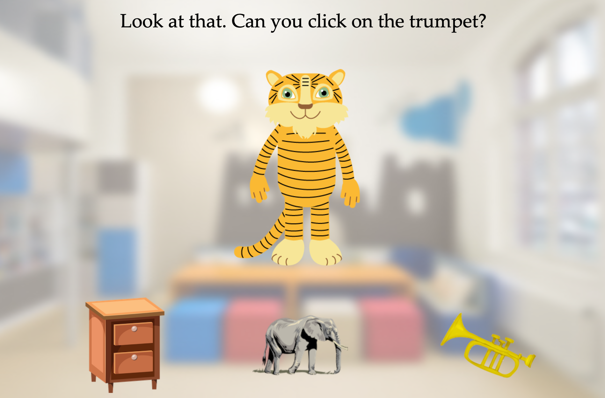

```{r setup, include = FALSE}
library(papaja)
library(tidyverse)
library(ggplot2)
library(brms)
library(ggthemes)
library(langcog)
library(ggpubr)
library(BayesFactor)
library(broom)
library(coda)
library(reshape2)
library(bayesplot)
library(ggridges)

estimate_mode <- function(s) {
  d <- density(s)
  return(d$x[which.max(d$y)])
}

hdi_upper<- function(s){
  m <- HPDinterval(mcmc(s))
  return(m["var1","upper"])
}

hdi_lower<- function(s){
  m <- HPDinterval(mcmc(s))
  return(m["var1","lower"])
}
```

```{r analysis-preferences,include = F}
# Seed for random number generation
set.seed(42)
knitr::opts_chunk$set(cache.extra = knitr::rand_seed)
knitr::opts_chunk$set(echo = F, warning = F, message = F)
```

```{r load data,include = F}
ex1_data <- read_csv(file="../data/data_ex1.csv")
exs_data <- read_csv(file="../data/data_exs.csv")
ex2_data <- read_csv(file="../data/data_ex2.csv")

ex1_adult_data <- read_csv(file="../data/adult_data_ex1.csv")
```

# Experiment 1

## Method

### Materials

The list below shows all words that were used to request objects during training trials for each of the four categories. The corresponding pictures are shown in figure 1 in the main manuscript. 

* fruit: strawberry, apple, banana, cherry, orange, melon, pineapple
* vehicles: car, truck, train, bus, airplane, boat, motorbike
* clothes: shoe, sock, hat, shirt, jacket, dress, skirt
* animals: dog, cat, horse, bear, cow, monkey, elephant

The object shown at test for each category was randomly selected from all objects of that category. 

```{r experiment1, cache = T, include = F}
## check sensitivity to prior
bf_t_age_prior <- ex1_data %>%
  group_by(age_group, id) %>%
  summarise(correct = mean(correct)) %>%
  summarise(correct = list(correct)) %>%
  group_by(age_group)%>%
  mutate(mean= mean(unlist(correct)),
         `default prior` = round(extractBF(ttestBF(unlist(correct), mu = 1/3))$bf,2),
         `wide prior` = round(extractBF(ttestBF(unlist(correct), mu = 1/3, rscale = "wide"))$bf,2),
         `ultrawide prior` = round(extractBF(ttestBF(unlist(correct), mu = 1/3,rscale = "ultrawide"))$bf,2),
         Age = as.character(age_group))%>%
  ungroup()%>%
  select(Age, `default prior`, `wide prior`, `ultrawide prior`)
``` 

```{r tableS1,results = "asis"}
apa_table(
  bf_t_age_prior
  , caption = "Bayes factors based on Bayesian t-test with different priors on standardized effect size"
  , escape = T
)
```

### Analysis 

We used `r cite_r("r-references.bib")` for all our analyses reported in the main manuscript and the supplementary material.

### Results 

We conducted a sensitivity analysis for the Bayes factors that informed the comparison to chance in each age group. We re-ran the analysis using wider priors than the default priors from the package. Table \ref{tab:tableS1} reports the results. Results show that the conclusions - 3- and 4-year-olds, but not 2-year-olds, select the object from the same category above chance - are robust to changes in the prior width. 

# Experiment 1 - adults

## Method

We tested `r length(unique(ex1_adult_data$id))` adults recruited via Amazon Mechanical Turk (MTurk). Participants were restricted to have an US IP address and received payment equivalent to an hourly wage of ~ \$9. 

## Materials

The setup and the procedure was the same as for children, with the following changes: Adults saw written instructions on top of the page instead of hearing pre-recorded audio files. The three objects were positioned at the bottom of the page (see Figure \ref{fig:adultsetup}). Furthermore, adults were tested in two additional categories with the following objects:

* instruments: drum, flute, guitar, piano, trumpet, violin, xylophone
* furniture: bed, chair, table, closet, drawer, sofa, lamp, stool

As a consequence, each adult participant received a total number of six trials, one per category, in a randomized order.

```{r adultsetup, include = T, fig.align = "center", fig.cap = "Left: Screenshot from the experimental setup for adults.", out.width="450px"}

```

## Results
```{r, include = F}
bf_t_adult <- ex1_adult_data %>%
  group_by(id) %>%
  summarise(correct = mean(correct)) %>%
  summarise(correct = list(correct)) %>%
  mutate(mean= mean(unlist(correct)),
         bf = extractBF(ttestBF(unlist(correct), mu = 1/3))$bf)
```

```{r, include = F}
# density plot
plot_post <- ex1_data %>%
  group_by(age_group,id) %>%
  summarise(correct = mean(correct))%>%
  summarise(correct = list(correct)) %>%
  group_by(age_group) %>%
  mutate(posterior = list((ttestBF(unlist(correct), mu = 1/3, posterior = T, iterations = 2000)[,"mu"])))%>%
  select(-correct)

plot_post_adult <- ex1_adult_data %>%
  group_by(id) %>%
  summarise(correct = mean(correct))%>%
  summarise(correct = list(correct)) %>%
  mutate(posterior = list((ttestBF(unlist(correct), mu = 1/3, posterior = T, iterations = 2000)[,"mu"])))%>%
  select(-correct)


plot_dens <- bind_rows(
  
  tibble(
  age = rep(c(2,3,4), each = 2000),
  posterior = c(unlist(plot_post%>%filter(age_group == "2") %>% pull(posterior)),unlist(plot_post%>%filter(age_group == "3") %>% pull(posterior)),unlist(plot_post%>%filter(age_group == "4") %>% pull(posterior)))
)%>%
  mutate(age = as.character(age)),

tibble(
  age = "Adults",
  posterior = c(unlist(plot_post_adult %>% pull(posterior)))
)
)%>%
  mutate(age = factor(age, levels = c("Adults","4","3","2")))


post_plot_adults <- ggplot(plot_dens, aes(y = age, x = posterior, fill = factor(stat(quantile))))+
  stat_density_ridges(
    geom = "density_ridges_gradient",
    calc_ecdf = TRUE,
    quantiles = c(0.025, 0.975)
  ) +
    labs(y="Age group", x="Proportion correct")+
  geom_vline(xintercept = 1/3, col = "black", lty = 2)+
  scale_fill_manual(values = c("#FF0000A0", "#A0A0A0A0", "#FF0000A0"))+
  guides(fill = F)+
  theme_few()+ 
  scale_y_discrete()
```

To evaluate whether adults selected the object from the same category above chance (33% correct), we aggregated responses across test trials and ran one sample Bayesian t-tests. We found substantial evidence for this hypothesis (mean proportion correct = `r bf_t_adult%>%pull(mean)`, BF~10~ = `r bf_t_adult%>%pull(bf)`). Figure \ref{fig:figpost} shows the corresponding posterior distribution in comparison to the results with children reported in the main manuscript. Like children, adults tracked the topic guiding the interaction with the speaker and used it to make inferences about the referent of an ambiguous pronoun.

```{r figpost, include = T, fig.align = "center", fig.cap = "Posterior probability distribution for the mean for each age group and for adults based on one sample Bayesian t-test. Grey regions indicate 95\\% credible intervals for each age group.", fig.width=6, fig.height=4, fig.fullwidth = TRUE}
post_plot_adults
```

# Supplementary Experiment

In this study, we varied the number of training trials before the test event. Procedures and analysis were pre-registered at https://osf.io/x2k4p. Our main focus was on condition differences and we therefore sampled a smaller number of children from each age group. 

## Method

### Participants
```{r participants-exs, include = F}
desc_exs <- exs_data%>%
  mutate(sex = ifelse(sex == "F",1,0))%>%
  group_by(age_group)%>%
  summarise(n = length(unique(id)), 
            age = mean(age_num), 
            min_age = min(age_num),
            max_age = max(age_num),
            sex = sum(sex)/4)
```

We tested 33 children, including `r desc_exs%>%filter(age_group == "3")%>%pull(n)` 3-year-olds (mean = `r desc_exs%>%filter(age_group == "3")%>%pull(age)`, range = `r desc_exs%>%filter(age_group == "3")%>%pull(min_age)` - `r desc_exs%>%filter(age_group == "3")%>%pull(max_age)`, `r desc_exs%>%filter(age_group == "3")%>%pull(sex)` girls) and `r desc_exs%>%filter(age_group == "4")%>%pull(n)` 4-year-olds (mean = `r desc_exs%>%filter(age_group == "4")%>%pull(age)`, range = `r desc_exs%>%filter(age_group == "4")%>%pull(min_age)` - `r desc_exs%>%filter(age_group == "4")%>%pull(max_age)`, `r desc_exs%>%filter(age_group == "4")%>%pull(sex)` girls). For details on population characteristics and ethical approval see experiment 1.

### Materials and Procedure

Study material and procedure were identical to study 1 with the following change: we administered two types of trials that varied in the number of training trials that preceded the test. *Low input* trials had one training trial while *high input* trials had six training trials. Participants received four trials, two in each condition. The order of conditions was randomized. Categories were randomly assigned to each condition and object positions were randomized in the same way as in study 1. Experimental procedures can be found in the associated online repository. 

### Results

```{r experimentS, cache = T, include = F}

exs_model_data <- exs_data%>%
  mutate(age_num = age_num - mean(age_num))

# exs_m1 <- brm(correct ~ age_num * condition + (condition|id) + (age_num + condition|target_category),
#                     data = exs_model_data, family = bernoulli(),
#           control = list(adapt_delta = 0.999, stepsize = 0.0001, max_treedepth = 50),
#           sample_prior = F,
#           chains = 4,
#           cores = 4,
#           save_all_pars = F,
#           iter = 5000)%>%
#     add_criterion("waic")%>%
#   saveRDS(., "../saves/exs_model1.rds")
# 
# exs_m2 <- brm(correct ~ age_num + condition + (condition|id) + (age_num + condition|target_category),
#                     data = exs_model_data, family = bernoulli(),
#           control = list(adapt_delta = 0.999, stepsize = 0.0001, max_treedepth = 50),
#           sample_prior = F,
#           chains = 4,
#           cores = 4,
#           save_all_pars = F,
#           iter = 5000)%>%
#     add_criterion("waic")%>%
#   saveRDS(., "../saves/exs_model2.rds")
# 
# 
# 
# exs_m3 <- brm(correct ~ age_num + (condition|id) + (age_num + condition|target_category),
#                     data = exs_model_data, family = bernoulli(),
#           control = list(adapt_delta = 0.999, stepsize = 0.0001, max_treedepth = 50),
#           sample_prior = F,
#           chains = 4,
#           cores = 4,
#           save_all_pars = F,
#           iter = 5000)%>%
#     add_criterion("waic")%>%
#   saveRDS(., "../saves/exs_model3.rds")


exs_m1 <-readRDS("../saves/exs_model1.rds")

exs_m2 <-readRDS("../saves/exs_model2.rds")

exs_m3 <-readRDS("../saves/exs_model3.rds")

ts <- loo_compare(exs_m1, exs_m2, exs_m3, criterion = "waic")%>%
  as.data.frame() %>%
  tibble::rownames_to_column("Model")%>%
  mutate(
    Model = recode(Model, exs_m1 = "correct ~ age * condition + RE", 
                   exs_m2 = "correct ~ age + condition + RE",
                   exs_m3 = "correct ~ age + RE"),
    weight = exp(elpd_waic) / sum(exp(elpd_waic)),
    weight = round(weight, 3),
    WAIC = round(waic, 2),
    SE = round(se_waic,2))%>%
  select(Model, WAIC, SE, weight)
```

```{r plot1, include = F}
pexs_1 <- exs_data %>%
  group_by(condition,age_group,age_num, id) %>%
  summarise(correct = mean(correct)) 

pexs_2 <- pexs_1 %>%
  group_by(condition,age_group) %>%
  multi_boot_standard(col = "correct")


samples2 <- posterior_samples(exs_m1, "^b")%>%
  mutate(sample = 1:length(b_age_num))

sample2 <- expand_grid(samples2,exs_model_data$age_num)%>%
  filter(sample < 2000)%>%
  mutate(condition = ifelse(sample <1000, "high_input", "low_input"),
         y = ifelse(condition == "high_input", plogis(b_Intercept + b_age_num * `exs_model_data$age_num`), plogis(b_Intercept + b_conditionlow_input + b_age_num * `exs_model_data$age_num` + `b_age_num:conditionlow_input` * `exs_model_data$age_num`)),
         age = `exs_model_data$age_num` + mean(exs_data$age_num))


map_model_2 <- tibble(
  age = rep(exs_model_data$age_num, 2),
  condition = c(rep("high_input", length(exs_model_data$age_num)),rep("low_input", length(exs_model_data$age_num))),
  int = fixef(exs_m1)[1,1],
  slope = fixef(exs_m1)[2,1],
  speak = fixef(exs_m1)[3,1],
  int_act = fixef(exs_m1)[4,1]
)%>%
  mutate(y = ifelse(condition == "high_input", plogis(int + slope * age), plogis(int + speak + slope * age + int_act * age)),
         age = age + mean(exs_data$age_num))

p2 <- ggplot() +
  geom_hline(yintercept = 1/3, lty=2, size = 1)+
  geom_jitter(data = pexs_1,aes(x = age_num, y= correct, col = condition), width = .00, height = .01, alpha = .5)+
  geom_line(data = sample2, aes(x = age, y = y, col = condition, group = sample), alpha = .05)+
  geom_line(data = map_model_2, aes(x = age, y = y, col = condition), size = 1)+
  #geom_smooth(data = ex2_data,aes(x = age_num, y= correct, col = condition), method = "glm", method.args = list(family = "binomial"), se = T, alpha = .5, size = 1.5 )+
  geom_pointrange(data = pexs_2, aes(x = age_group+.5, y = mean, ymin = ci_lower, ymax = ci_upper, col = condition),size = .8, position = position_dodge(width = .2), pch = 4)+
  labs(x="Age",y="Proportion correct")+
  theme_few() +
  ylim(-0.05,1.05)+
  xlim(3,5)+
  guides(alpha = F)+
  scale_color_manual(name = "Input",
                   breaks = c("low_input", "high_input"),
                   labels = c("Low", "High"),
                   values = c("#CC6677", "#DDCC77"))+
  theme(legend.position = "right")
```

We used WAIC scores and weights to compare models including condition as a predictor to models lacking it. Table \ref{tab:tableS2} shows the results of the model comparison. The model without condition as a predictor (either as main effect or as an interaction with age) provided the best fit. In this model, the predictor for age was positive, but not reliably different from zero ($\beta$ = `r fixef(exs_m3)[2,1]`, 95% CI = `r fixef(exs_m3)[2,3]` - `r fixef(exs_m3)[2,4]`) suggesting a slight increase in performance with age. Figure \ref{fig:plotS1} shows that, in contrast to study 1, 3-year-olds had difficulties with this version of the task. 

```{r tableS2,results = "asis"}
apa_table(
  ts
  , caption = "Model comparison for Experiment 2"
  , note = "All models included random intercepts for particiapnt and speaker and random slopes for condition."
  , escape = T
)
```

```{r plotS1, include = T, fig.align = "center", fig.cap = "Correct responses in supplementary experiment by age and condition. Transparent dots show aggregated data from individual participants. Blue and red crosses show mean within age bin based on aggregated data with 95\\% CI based on non-parametric bootstrap. Colored lines show the mean of the posterior distribution for each condition based on the interaction model (note that the model comparison favored the model without condition). Lighter lines show 1000 random draws per condition from the model posterior to depict uncertainty. Dotted line indicates level of performance expected by chance.", out.width = '60%'}
p2
```

### Discussion

The results of this experiment suggest that hearing fewer examples of objects from the implied category does not automatically result in worse performance overall. However, this interpretation should be taken with caution. As it turns out, mixing low and high input trials substantially affected 3-year-olds' performance in the task. That is, in contrast to study 1 and 2, they struggled with the basic inference. This suggests that including low input trials made the task harder overall. The difference between conditions might be more prominent in a between subjects design. However, more data is needed to reach a conclusion and, as of now, we see these results as inconclusive. 

# Exploratory analysis

This is an exploratory analysis that was not pre-registered. From all experiments we select the data with six training trials and the same speaker. That is, we included all data from study 1, the high input condition from the supplementary experiment and the same speaker condition from study 2.

## Methods

### Participants 

```{r}
con_data <- bind_rows(
  ex1_data, 
  exs_data%>%filter(condition == "high_input")%>%select(-condition),
  ex2_data%>%filter(condition == "same_speaker")%>%select(-condition)
) %>%
  mutate(target_category = ifelse(target_category == "mammals", "animals", target_category))
```

Data from all children (N = `r length(unique(con_data$id))`) who participated in one of the three experiments were included. For detailed information about age and population characteristics see individual experiments. 

### Analysis 

We compared three models. The interaction model included an interaction between age and category, the main effects model included age and category as main effects and the baseline mode only included age as a predictor. Models were compared in the same way as in previous experiments. Furthermore, to investigate the relative difficulty of each target category, we compare the posterior distributions of the parameter estimate for each category.    

### Results

Figure \ref{fig:plotS2}A shows that performance differed widely across categories. This visual impression was corroborated in the model comparison. Table \ref{tab:tableS3} shows that the main effects model with category as a predictor was clearly favored. For comparisons between categories we set animals as the reference category. Figure \ref{fig:plotS2}B and \ref{fig:plotS3} show that children chose the object from the same category most often when fruits was the target category. Vehicles and animals resulted in intermediate levels of performance while clothes was the most difficult category. 

## Discussion

This exploratory analysis suggests that children's ability to infer the topic of a conversation depends, in part, on the implied topic itself. Categories may differ in difficulty either because some category members might be less familiar to children and/or because children are less familiar with the category itself. The general discussion section in the main manuscript offers a discussion of how these results relate to the other studies. 

```{r suppanalysis, cache = T, include = F}
con_model_data <- con_data %>%
  mutate(age_num = age_num - mean(age_num))
  

# con_m1 <- brm(correct ~ age_num * target_category + (1|id),
#                     data = con_model_data, family = bernoulli(),
#           control = list(adapt_delta = 0.99),
#           sample_prior = F,
#           chains = 4,
#           cores = 4,
#           save_all_pars = F,
#           iter = 5000)%>%
#     add_criterion("waic")%>%
#   saveRDS(., "../saves/con_model1.rds")
# 
# con_m2 <- brm(correct ~ age_num + target_category + (1|id),
#                     data = con_model_data, family = bernoulli(),
#           control = list(adapt_delta = 0.99),
#           sample_prior = F,
#           chains = 4,
#           cores = 4,
#           save_all_pars = F,
#           iter = 5000)%>%
#     add_criterion("waic")%>%
#   saveRDS(., "../saves/con_model2.rds")
# 
# con_m3 <- brm(correct ~ age_num + (1|id),
#                     data = con_model_data, family = bernoulli(),
#           control = list(adapt_delta = 0.99),
#           sample_prior = F,
#           chains = 4,
#           cores = 4,
#           save_all_pars = F,
#           iter = 5000)%>%
#     add_criterion("waic")%>%
#   saveRDS(., "../saves/con_model3.rds")


con_m1 <-readRDS("../saves/con_model1.rds")

con_m2 <-readRDS("../saves/con_model2.rds")

con_m3 <-readRDS("../saves/con_model3.rds")

#bf_exc <- bayes_factor(con_m1, con_m2, log = FALSE)

tcon <- loo_compare(con_m1, con_m2, con_m3, criterion = "waic")%>%
  as.data.frame() %>%
  tibble::rownames_to_column("Model")%>%
  mutate(
    Model = recode(Model, 
                   con_m1 = "correct ~ age * category + RE",
                   con_m2 = "correct ~ age + category + RE", 
                  con_m3 = "correct ~ age + RE"),
    weight = exp(elpd_waic) / sum(exp(elpd_waic)),
    weight = round(weight, 3),
    WAIC = round(waic, 2),
    #BF = c(round(bf_exs_1$bf,2),round(bf_exs_2$bf,2) ,"-"),
    SE = round(se_waic,2))%>%
  select(Model, WAIC, SE, weight)
```

```{r plot2, include = F}
pc1 <- con_data%>%
  mutate(age_group = as.character(age_group))%>%
  group_by(experiment, target_category,age_group, id) %>%
  summarise(correct = mean(correct)) 

pc2 <- pc1 %>%
  group_by(target_category,age_group) %>%
  multi_boot_standard(col = "correct")

cp1 <- ggplot()+
  geom_hline(yintercept = 1/3, lty=2)+
  geom_jitter(data = pc1, aes(x = age_group, y = correct, col = target_category), position = position_jitterdodge(jitter.width = .1,jitter.height = .025, dodge.width = .75 ), alpha = .3)+
  geom_pointrange(data = pc2, aes(x = age_group, y = mean, ymin = ci_lower, ymax = ci_upper, col = target_category), position = position_dodge(width = .75), pch = 4)+
  #facet_grid(~experiment)+
  labs(x="Age",y="Proportion correct")+
  theme_few()+
  scale_color_colorblind(name = "Category")

samples_con <- posterior_samples(con_m2, "^b")%>%
  mutate(sample = 1:length(b_age_num))

con_sample <- expand_grid(samples_con,unique(con_model_data$age_num))%>%
  filter(sample < 4000)%>%
  mutate(y = ifelse(sample < 1000, plogis(b_Intercept + b_age_num * `unique(con_model_data$age_num)`),
                    ifelse( sample > 1000 & sample < 2000, plogis(b_Intercept + b_target_categoryfruits +  b_age_num * `unique(con_model_data$age_num)`),
                           ifelse(sample > 2000 & sample < 3000, plogis(b_Intercept + b_target_categoryclothes +  b_age_num * `unique(con_model_data$age_num)`),
                                  plogis(b_Intercept + b_target_categoryvehicles +  b_age_num * `unique(con_model_data$age_num)`)))),
         Category = ifelse(sample < 1000, "animals",
                    ifelse( sample > 1000 & sample < 2000, "fruits",
                           ifelse(sample > 2000 & sample < 3000, "clothes",
                                  "vehicles"))),
         age = `unique(con_model_data$age_num)` + mean(con_data$age_num))


map_con <- tibble(
  age = rep(con_model_data$age_num, 4),
  Category = c(rep("clothes", length(con_model_data$age_num)),rep("fruits", length(con_model_data$age_num)),rep("animals", length(con_model_data$age_num)),rep("vehicles", length(con_model_data$age_num))),
  int = fixef(con_m2)[1,1],
  slope = fixef(con_m2)[2,1],
  clothes = fixef(con_m2)[3,1],
  fruits = fixef(con_m2)[4,1],
  vehicles = fixef(con_m2)[5,1]
)%>%
  mutate(y = ifelse(
    Category == "animals", plogis(int + slope * age),
    ifelse(Category == "fruits", plogis(int + fruits + slope * age),
           ifelse(Category == "clothes", plogis(int + clothes + slope * age),
                  plogis(int + vehicles + slope * age)))),
         age = age + mean(con_data$age_num))


cp2 <- ggplot() +
  geom_hline(yintercept = 1/3, lty=2)+
  geom_line(data = con_sample, aes(x = age, y = y, col = Category, group = sample), alpha = .01)+
  geom_line(data = map_con, aes(x = age, y = y, col = Category), size = 1)+
  #geom_pointrange(data = pex3_2, aes(x = age_group+.5, y = mean, ymin = ci_lower, ymax = ci_upper, col = condition),size = .8, position = position_dodge(width = .2), pch = 4)+
  labs(x="Age",y="Proportion correct")+
  theme_few() +
  ylim(-0.05,1.05)+
  xlim(2,5)+
  guides(alpha = F)+
  scale_color_colorblind(name = "Category")+
  theme(legend.position = "right")


cp3 <-bayesplot::mcmc_areas(as.array(con_m2), 
                      pars = c("b_target_categoryfruits", "b_target_categoryclothes", "b_target_categoryvehicles"), 
                      prob = 0.95)+
  geom_vline(xintercept = 0, lty = 2, col = "black")+
  scale_y_discrete(breaks=c("b_target_categoryfruits","b_target_categoryclothes","b_target_categoryvehicles"),
        labels=c("Fruits", "Clothes", "Vehicles"))+
  theme_few()

```

```{r tableS3,results = "asis"}
apa_table(
  tcon
  , caption = "Model comparison for exploratory analysis on category differences"
  , note = "All models included random intercepts for particiapnt and speaker and random slopes for category within speaker"
  , escape = T
)
```

```{r plotS2, include = T, fig.align = "center", fig.cap = "(A) Data plotted by age bin and category. Transparent dots show data from individual participants. Colored crosses show mean within age bin and category with 95\\% confidence intervals based on non-parametric bootstrap. (B) Correct responses for age continously. Colored lines show the mean of the posterior distribution of the model including category. Lighter lines show 1000 random draws from the model posterior to depict uncertainty in the model. Dotted line indicates level of performance expected by chance.", out.width = '100%', fig.asp = .5}
ggarrange(cp1, cp2, nrow = 1, labels = c("A","B"), common.legend = T, legend = "bottom")
```

```{r plotS3, include = T, fig.align = "center", fig.cap = "Posterior distribution of model estimates for each category with animals as the reference category. Thick blue lines show mean and shaded regions show 95\\% credible intervals.", out.width = '60%', fig.asp = .5}
cp3
```

\newpage

# References
```{r create_r-references}
r_refs(file = "r-references.bib")
```

\begingroup
\setlength{\parindent}{-0.5in}
\setlength{\leftskip}{0.5in}

<div id = "refs"></div>
\endgroup
